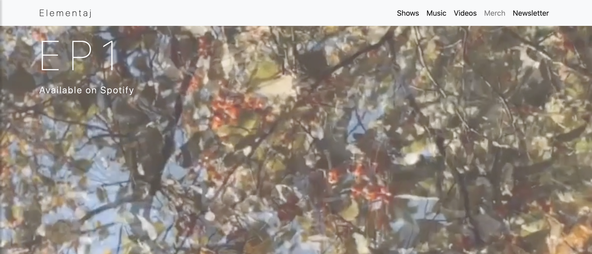
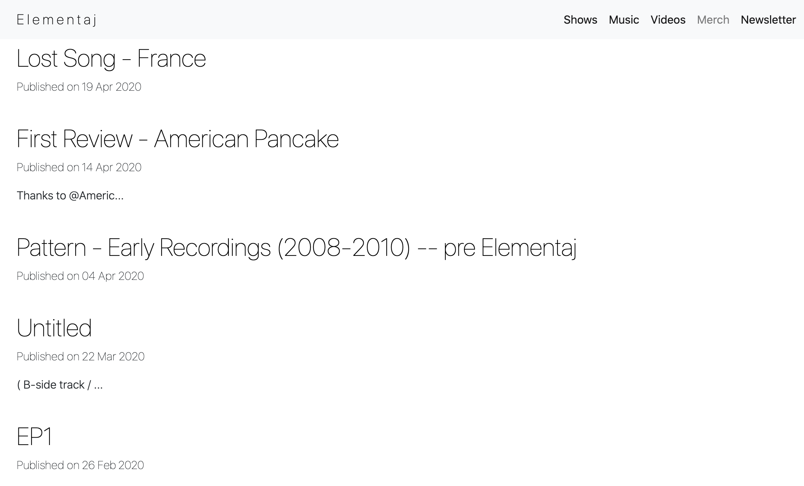
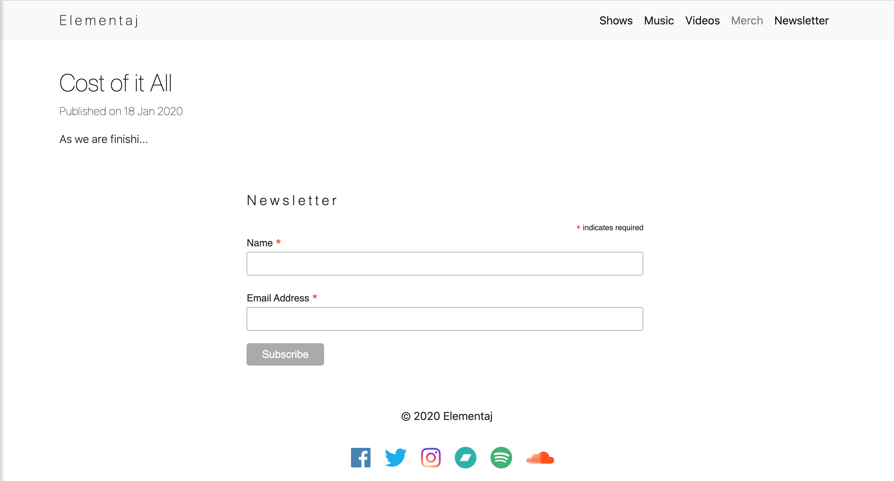
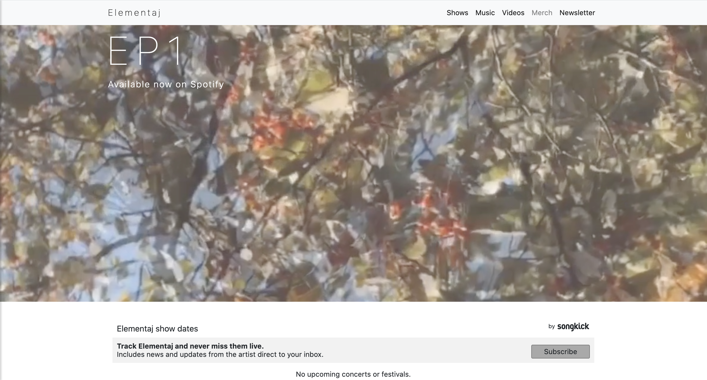
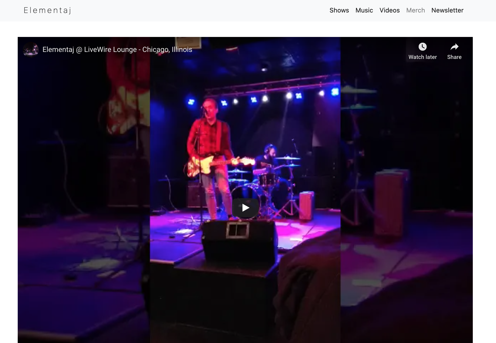

# Elementaj-site
Created a website for my band Elementaj.

## Built With

- HTML
- CSS
- jQuery
- Bootstrap (Version 4.1.3)
- Songkick tour widget
- Bandcamp music player widget 
- Jekyll (Implementing the Blog Feature)
- MailChimp

## Screenshots

Home Page Part One

Home Page Part Two

Home Page Part Three

Home Page Part Four

Shows Page

Music Page

Videos Page

## Author

**Andrew Zdunek** (https://github.com/ajzdunek)

